# 🌐 Lap6 - Local Passport Website  

---

## ⚙️ SET UP nơi lưu trữ cho session bằng **FileStore**  
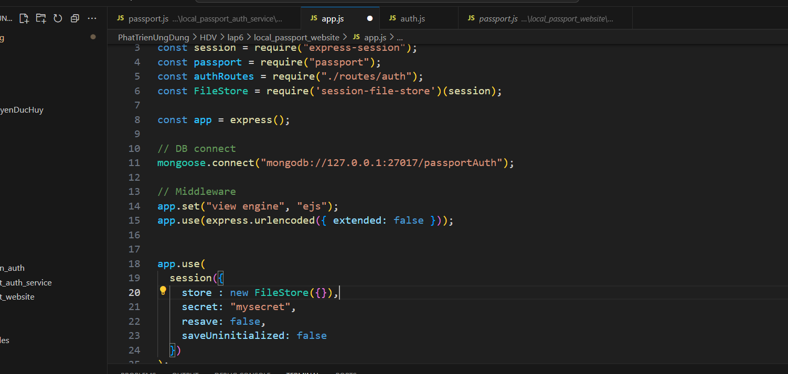  

---

## 🚫 Truy cập `/profile` khi chưa đăng nhập  
Kết quả: bị chuyển hướng lại trang login vì chưa đăng nhập.  

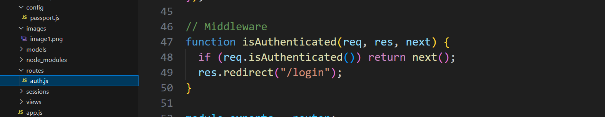  

🔒 Đây là **middleware check login** dùng để bảo vệ URI `/profile`.  
👉 Yêu cầu phải đăng nhập mới có thể truy cập.  

---

## 📝 Tiến hành tạo tài khoản  
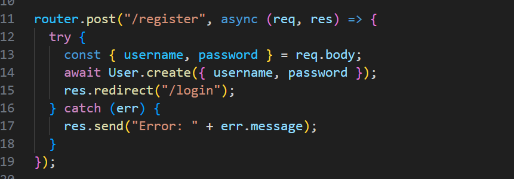  

### ✍️ Tạo tài khoản thông qua giao diện website  
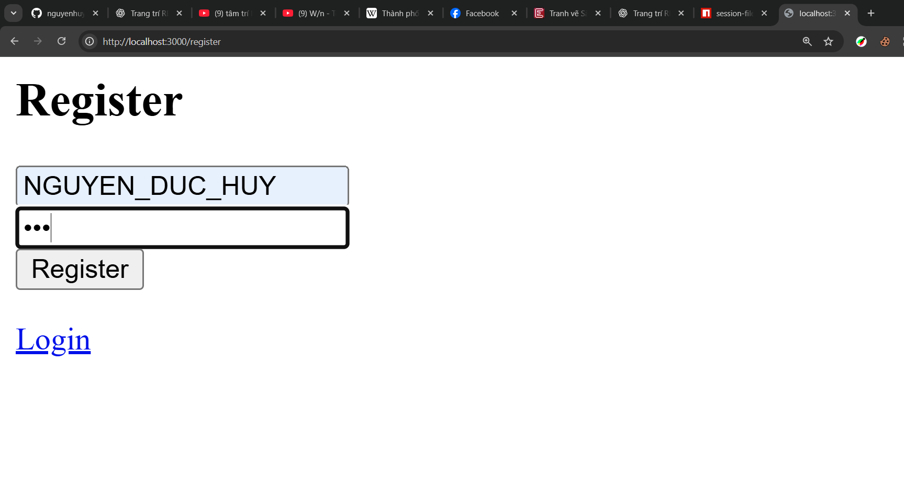  

### 🗄️ Kiểm tra database đã có thông tin chưa  
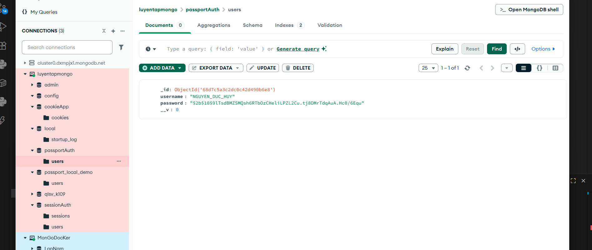  

---

## 🔑 Đăng nhập  

### 📌 Đoạn mã gọi đăng nhập  
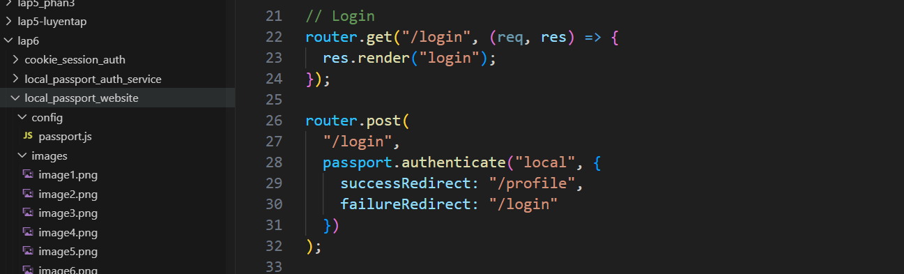  

### 📌 Đoạn mã kiểm tra tên đăng nhập & mật khẩu  
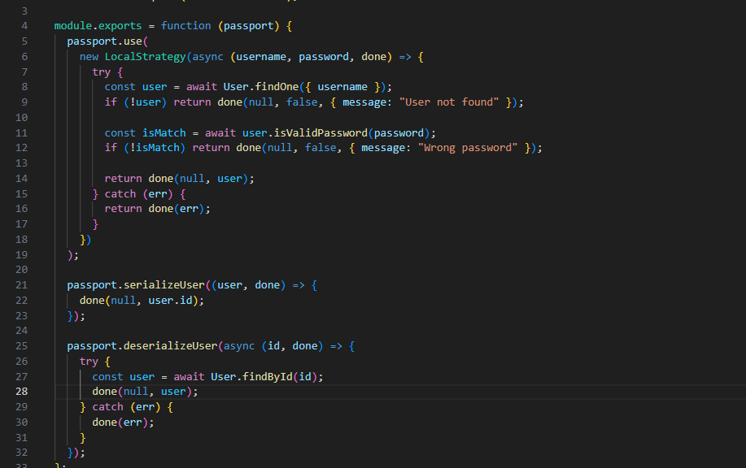  

---

## 💾 Lưu trữ thông tin đăng nhập ở FileStore  
Kết quả khi đăng nhập thành công:  

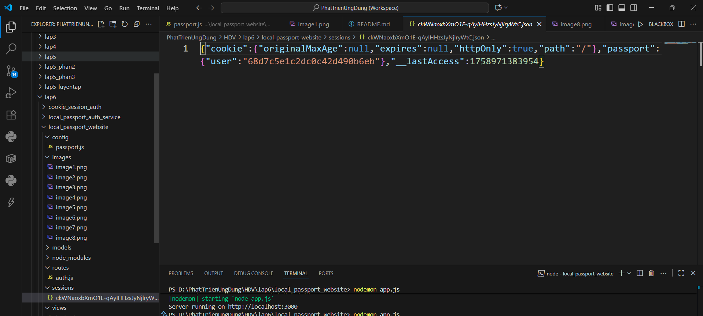  

---

## 🏠 Sau khi đăng nhập thành công → vào trang chủ  
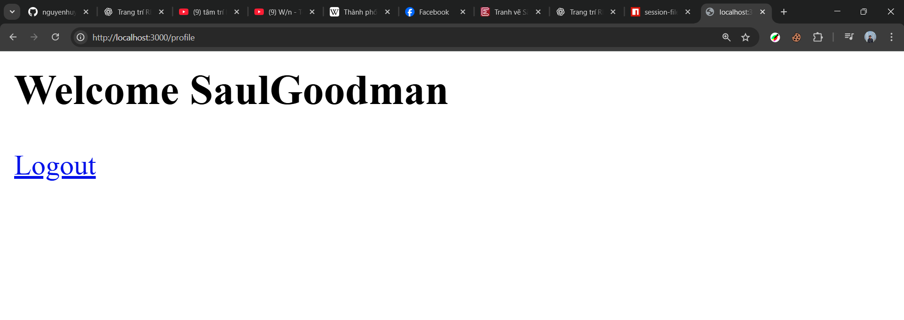  

---

## 🚪 Đăng xuất  

- Sau khi đăng xuất, thông tin đăng nhập trong **FileStore** đã bị xóa.  

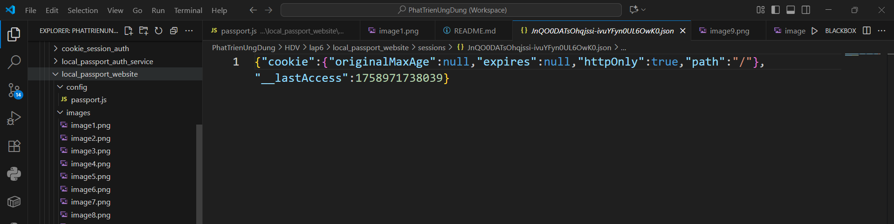  

### 📌 Đoạn mã đăng xuất  
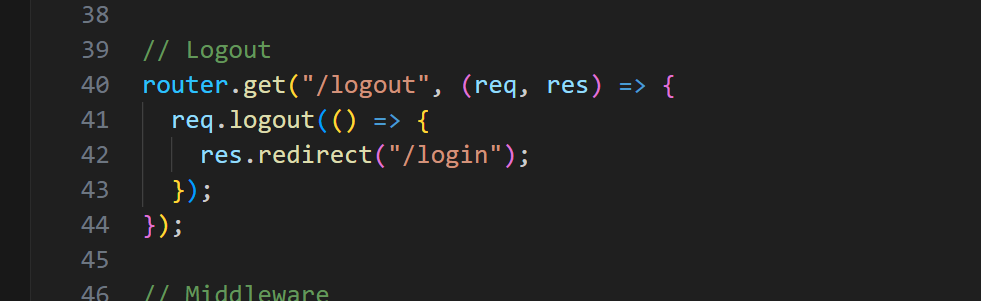  

---
